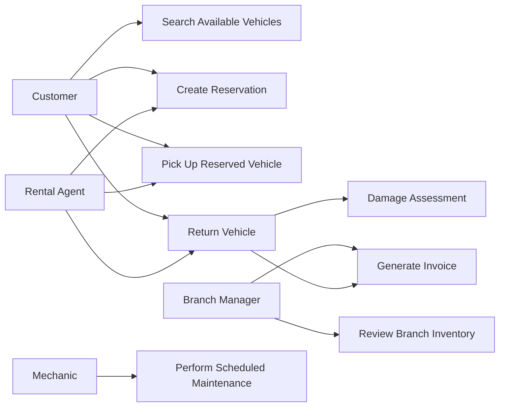
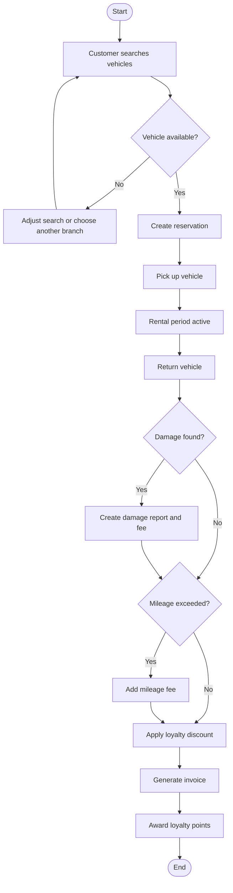
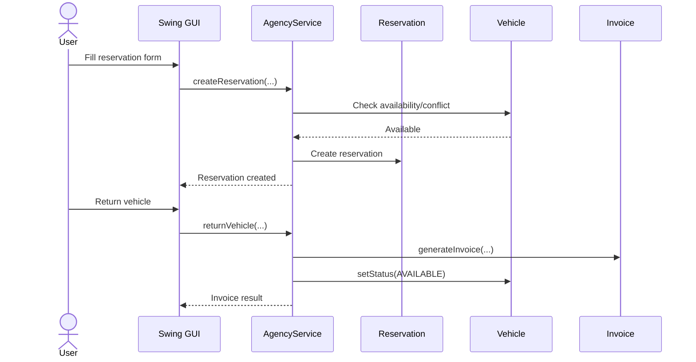
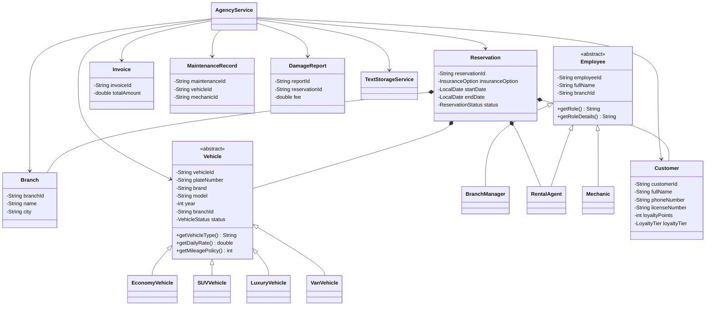

# FleetOrbit Rental Suite UML Diagrams

## Use Case Diagram

```mermaid
flowchart LR
    Customer["Customer"] --> Search["Search Available Vehicles"]
    Customer --> Reserve["Create Reservation"]
    Customer --> Pickup["Pick Up Reserved Vehicle"]
    Customer --> Return["Return Vehicle"]
    RentalAgent["Rental Agent"] --> Reserve
    RentalAgent --> Pickup
    RentalAgent --> Return
    BranchManager["Branch Manager"] --> Inventory["Review Branch Inventory"]
    BranchManager --> Invoice["Review Invoices"]
    Mechanic["Mechanic"] --> Maintenance["Perform Scheduled Maintenance"]
    Return --> Damage["Damage Assessment"]
    Return --> Invoice["Generate Invoice"]
```

## Activity Diagram

```mermaid
flowchart TD
    Start([Start]) --> Search["Customer searches vehicles"]
    Search --> Available{"Vehicle available?"}
    Available -- No --> Retry["Adjust search or choose another branch"]
    Retry --> Search
    Available -- Yes --> Create["Create reservation"]
    Create --> Pickup["Pick up vehicle"]
    Pickup --> Drive["Rental period active"]
    Drive --> Return["Return vehicle"]
    Return --> Damage{"Damage found?"}
    Damage -- Yes --> DamageFee["Create damage report and fee"]
    Damage -- No --> Mileage{"Mileage exceeded?"}
    DamageFee --> Mileage
    Mileage -- Yes --> Extra["Add mileage fee"]
    Mileage -- No --> Discount["Apply loyalty discount"]
    Extra --> Discount
    Discount --> Invoice["Generate invoice"]
    Invoice --> Points["Award loyalty points"]
    Points --> End([End])
```

## Sequence Diagram

```mermaid
sequenceDiagram
    actor User
    participant GUI as Swing GUI
    participant Service as AgencyService
    participant Reservation as Reservation
    participant Vehicle as Vehicle
    participant Invoice as Invoice

    User->>GUI: Fill reservation form
    GUI->>Service: createReservation(...)
    Service->>Vehicle: Check availability/conflict
    Vehicle-->>Service: Available
    Service->>Reservation: Create reservation
    Service-->>GUI: Reservation created
    User->>GUI: Return vehicle
    GUI->>Service: returnVehicle(...)
    Service->>Invoice: generateInvoice(...)
    Service->>Vehicle: setStatus(AVAILABLE)
    Service-->>GUI: Invoice result
```

## Class Diagram

```mermaid
classDiagram
    class Branch {
        -String branchId
        -String name
        -String city
    }

    class Vehicle {
        <<abstract>>
        -String vehicleId
        -String plateNumber
        -String brand
        -String model
        -int year
        -String branchId
        -VehicleStatus status
        +getVehicleType() String
        +getDailyRate() double
        +getMileagePolicy() int
    }

    class EconomyVehicle
    class SUVVehicle
    class LuxuryVehicle
    class VanVehicle

    class Employee {
        <<abstract>>
        -String employeeId
        -String fullName
        -String branchId
        +getRole() String
        +getRoleDetails() String
    }

    class BranchManager
    class RentalAgent
    class Mechanic

    class Customer {
        -String customerId
        -String fullName
        -String phoneNumber
        -String licenseNumber
        -int loyaltyPoints
        -LoyaltyTier loyaltyTier
    }

    class Reservation {
        -String reservationId
        -InsuranceOption insuranceOption
        -LocalDate startDate
        -LocalDate endDate
        -ReservationStatus status
    }

    class Invoice {
        -String invoiceId
        -double totalAmount
    }

    class MaintenanceRecord {
        -String maintenanceId
        -String vehicleId
        -String mechanicId
    }

    class DamageReport {
        -String reportId
        -String reservationId
        -double fee
    }

    class AgencyService
    class TextStorageService

    Vehicle <|-- EconomyVehicle
    Vehicle <|-- SUVVehicle
    Vehicle <|-- LuxuryVehicle
    Vehicle <|-- VanVehicle

    Employee <|-- BranchManager
    Employee <|-- RentalAgent
    Employee <|-- Mechanic

    Reservation *-- Customer
    Reservation *-- Vehicle
    Reservation *-- Branch
    Reservation *-- RentalAgent
    AgencyService --> Branch
    AgencyService --> Vehicle
    AgencyService --> Customer
    AgencyService --> Reservation
    AgencyService --> Invoice
    AgencyService --> MaintenanceRecord
    AgencyService --> DamageReport
    AgencyService --> TextStorageService
```
